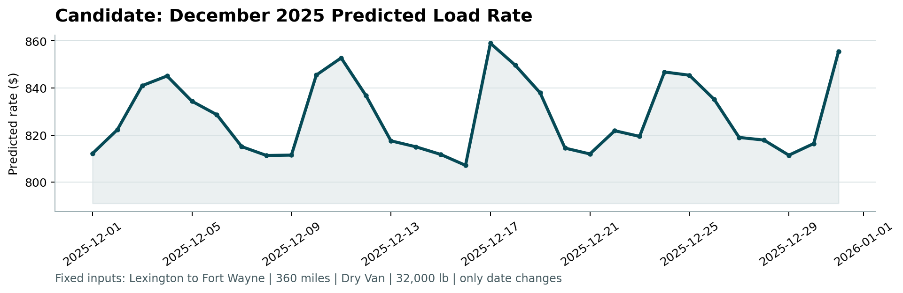

# Freight Rate Prediction Challenge — Assessment Report

**Prepared for:** Spotter Machine Learning Engineer Assessment

---

## 1. Overview

The objective of this challenge was to train a machine learning model capable of predicting freight rates (`posted_rate`) for future loads, using historical shipment data from January to October 2025. The final model was evaluated on an unseen validation set spanning November and December 2025, and additionally used to forecast daily rates for a fixed Lexington-to-Fort-Wayne route throughout December.

---

## 2. Dataset Overview

| Dataset | Records | Date Range | Target |
|---|---|---|---|
| `train-test.csv` | 48,000 | Jan 1 – Oct 31, 2025 | `posted_rate` ✅ |
| `validation.csv` | 12,000 | Nov 1 – Dec 31, 2025 | Unknown (to predict) |
| `december-chart-inputs.csv` | 31 | Dec 1 – Dec 31, 2025 | Unknown (to predict) |

**Features Available:** `pickup`, `delivery`, coordinates, `distance`, `equipment`, `weight`, `date`, `market_index`, `quote_signal`.

---

## 3. Data Exploration & Key Findings

### 3.1 Date Range & Temporal Boundaries
The training set spans **January to October 2025** and the validation set spans **November to December 2025** — a completely unseen future period. This confirmed that a **random cross-validation split is not appropriate** here, as it would leak future market information into the past. A time-based split was mandatory.

### 3.2 Target Variable: `posted_rate`
The target distribution is **highly right-skewed**, ranging from ~$57 to over ~$25,500 with a mean of ~$2,374. Applying a `log1p` transform yields a symmetric, bell-shaped distribution. We trained the model on `log1p(posted_rate)` and inverted predictions with `expm1`.

### 3.3 Correlation Analysis
A correlation matrix of numerical features against `posted_rate` revealed:

| Feature | Correlation with `posted_rate` |
|---|---|
| `distance` | **0.91** |
| `weight` | ~0.03 |
| `market_index` | ~0.03 |
| `quote_signal` | ~-0.04 |

`distance` is overwhelmingly the strongest linear predictor. `weight`, `market_index`, and `quote_signal` have low linear correlations but carry important **non-linear interactions** that LightGBM can capture.

### 3.4 Equipment Type Analysis
Boxplot analysis revealed distinct pricing tiers across equipment types:
- **Reefers:** Highest median rates (refrigeration/specialized equipment cost)
- **Flatbeds:** Second highest (open-load handling requirements)
- **Dry Vans:** Baseline pricing

This confirmed `equipment` as a primary categorical feature.

### 3.5 Weight Distribution by Equipment Type
Each equipment type has a **distinct weight profile**. Since weight distributions differ significantly by trailer type, imputing missing `weight` values using the **equipment-group median** is far more accurate than a global median and avoids introducing systematic bias.

### 3.6 Temporal Trends
- **Weekly average rates** show clear fluctuation and a general macro trend across the 10 months of training data.
- **Day-of-week analysis** confirms that rates peak mid-week (Tuesday–Thursday) when carrier capacity is in highest demand, and drop on weekends. This directly justifies including `day_of_week` as a model feature.
- **Market index and quote signal** vary meaningfully over time (not constants), confirming their value as time-varying market state features.

### 3.7 Route Volume Analysis
With **64 unique cities**, there are hundreds of possible routes. The top-10 routes by volume show concentrated shipping corridors. LightGBM's native categorical handling lets the model learn route-specific pricing without one-hot encoding.

### 3.8 Rate by Distance Bin
Segmenting routes into Short (<300mi), Medium (300–800mi), Long (800–1500mi), and Very Long (>1500mi) hauls shows rate distributions shift significantly across bins — but with large within-bin variance, confirming that `distance` alone does not fully explain rates. Equipment, date, and market features all contribute additional signal.

---

## 4. Data Quality & Imputation

| Issue | Count (Train) | Count (Validation) | Fix Applied |
|---|---|---|---|
| Missing `weight` | 300 | 165 | Imputed with **equipment-group median** |
| Missing `market_index` | 374 | 249 | Imputed with **training median** |

---

## 5. Validation Strategy: Time-Based Split

Since the validation set (November–December 2025) is a contiguous future period, we implemented a **time-based train/validation split**:

- **Model Training:** January 1 – August 31, 2025
- **Local Validation:** September 1 – October 31, 2025

This mirrors the final test conditions and ensures no future information leaks into training.

---

## 6. Feature Engineering

| Feature | Description | Rationale |
|---|---|---|
| `day_of_week` | 0=Monday, 6=Sunday | Captures weekday/weekend pricing differences |
| `day_of_year` | 1–365 | Seasonal index |
| `sin_day_of_year` | Cyclic encoding | Smooth seasonal generalisation to unseen months (Nov, Dec) |
| `cos_day_of_year` | Cyclic encoding | Same as above |
| `days_since_start` | Days since Jan 1, 2025 | Captures market inflation / time trend |
| `haversine_distance` | Great-circle distance from coordinates | Geodetic routing signal |
| `lat_diff`, `lon_diff` | Absolute coordinate differences | Directional pricing gradients |
| Weight imputation | Filled with equipment-group median | Avoids leakage and systematic bias |

**Why cyclic encoding instead of raw month?** November and December are **entirely absent from the training set**. One-hot encoding `month` would produce all-zero vectors for these months at inference time, causing model failure. Cyclic sine/cosine of `day_of_year` generalizes smoothly to any future date without this problem.

---

## 7. Model: LightGBM Regression

We chose **LightGBM (GBDT)** for the following reasons:
- Natively handles categorical features like `pickup`, `delivery`, `equipment` — no encoding overhead
- Robust to outliers (we still apply log-transform for stability)
- Fast training on 48,000 rows with 19 features
- No need for feature normalization

**Hyperparameters:**

| Parameter | Value |
|---|---|
| `objective` | `regression` |
| `metric` | MAE |
| `learning_rate` | 0.03 |
| `num_leaves` | 31 |
| `max_depth` | 8 |
| `bagging_fraction` | 0.8 |
| `feature_fraction` | 0.8 |
| `num_boost_round` | 1200 |

---

## 8. Local Validation Results (September–October 2025)

| Metric | Value |
|---|---|
| **MAE** | **$149.21** |
| **RMSE** | **$646.51** |
| **MAPE** | **6.61%** |
| **R² Score** | **0.8205** |

The model explains **82.05%** of the variance in freight rates on the out-of-time validation set. The Actual vs. Predicted scatter plot showed tight alignment along the diagonal with no systematic bias, confirming the model is well-calibrated.

---

## 9. Feature Importance

Post-training feature importance (LightGBM gain) confirmed:
1. `distance` — dominant predictor (consistent with 0.91 correlation)
2. `pickup`, `delivery` coordinates — route geography drives pricing
3. `days_since_start`, `sin_day_of_year`, `cos_day_of_year` — temporal signals are meaningful
4. `market_index`, `quote_signal` — contribute non-linearly even with low linear correlation

---

## 10. December 2025 Scenario Predictions

For the December fixed-route scenario (Lexington → Fort Wayne, Dry Van, 32,000 lbs, 360 miles), we:
- Sourced December market conditions (`market_index`, `quote_signal`) from the validation set's December rows (daily averages)
- Looked up Lexington and Fort Wayne coordinates from the training set
- Ran predictions through the final model trained on the full 10-month dataset

The predicted daily rates show realistic fluctuations across the month, reflecting day-of-week and market dynamics.

---

## 11. Deliverables

| File | Description |
|---|---|
| `freight_rate_prediction.ipynb` | Complete EDA, feature engineering, validation, and modeling notebook |
| `train_predict.py` | Clean reproducible training and prediction script |
| `validation_predictions.csv` | 12,000 rate predictions for the validation set |
| `data/december-chart-inputs.csv` | Completed December scenario with predicted rates |
| `scorer_results/candidate_december.png` | December rate trend chart (generated by `score.py`) |
